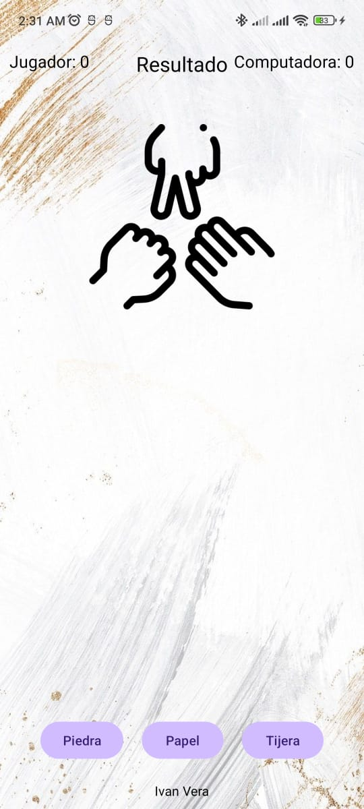
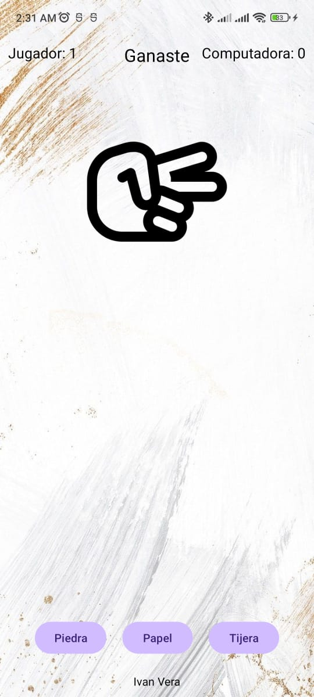
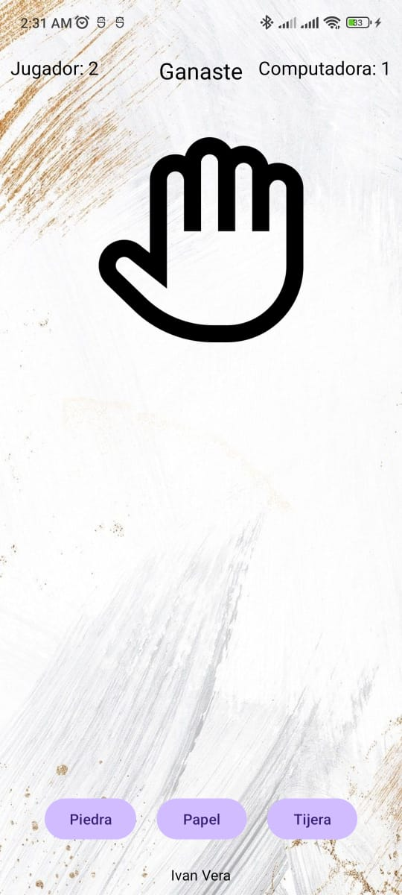

# Piedra, Papel o Tijera - Juego en Android

Una aplicación móvil desarrollada en **Android Studio** que permite jugar al clásico juego de **Piedra, Papel o Tijera** contra la computadora. Ideal para practicar desarrollo en Android y pasar un rato divertido.

## APK
[Aplicacion](https://drive.google.com/file/d/1b7nhoBE44989UHbOVJGdTFlr4tNAG-fd/view?usp=sharing)

## Características

- **Interfaz intuitiva**: Botones claros y diseño sencillo.
- **Juego contra la computadora**: Elección aleatoria para simular al contrincante.
- **Reglas clásicas**:
  - Piedra gana a Tijera.
  - Tijera gana a Papel.
  - Papel gana a Piedra.
- **Gestión del estado**: Puntuación del jugador y de la computadora.

## Capturas de Pantalla
<table>
  <tr>
    <td></td>
    <td></td>
    <td></td>
    <td></td>
  </tr>
</table>

## Requisitos

- **Android Studio** 4.0 o superior.
- Dispositivo o emulador con **Android 5.0 (API 21)** o superior.

## Cómo Jugar

1. Selecciona una opción entre **Piedra**, **Papel** o **Tijera**.
2. La computadora elegirá automáticamente una opción.
3. Mira el resultado en pantalla y verifica quién ganó.
4. Compite contra la computadora acumulando puntos.

## Instalación

1. Clona este repositorio:
   ```bash
   git clone https://github.com/IvanVY/Juego-Piedra-Papel-o-Tijera.git
